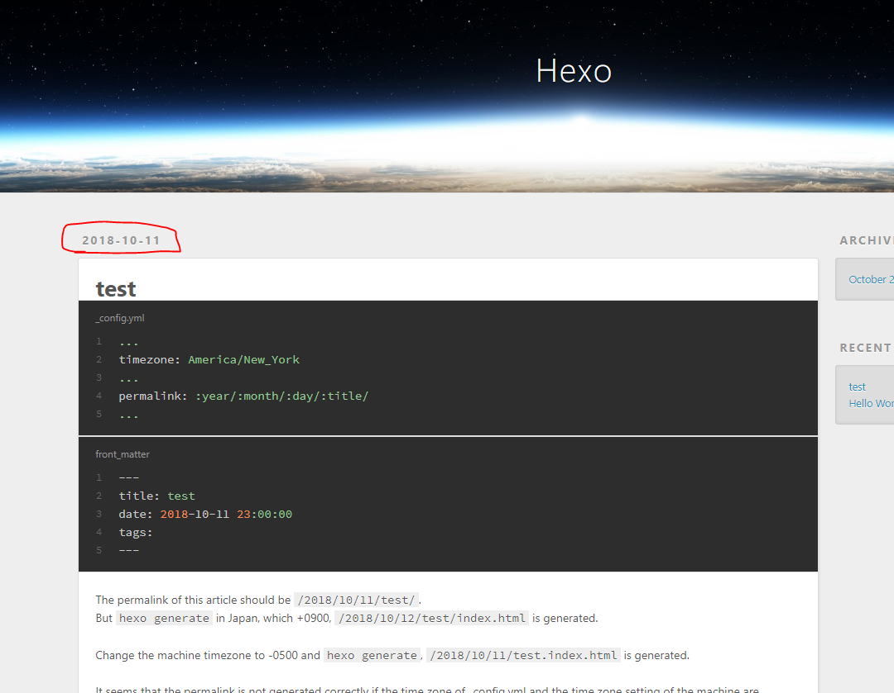

_config.yml is this:

``` yaml _config.yml
...
timezone: America/New_York
...
permalink: :year/:month/:day/:title/
...
```

and `source/_posts/test.md` is this:

``` yaml front_matter
---
title: test
date: 2018-10-11 23:00:00
tags:
---
```

The permalink of this article should be `/2018/10/11/test/`.
But `hexo generate` in Japan, which +0900, `/2018/10/12/test/index.html` is generated.


The article date is correct (2018/10/11).



Change the machine timezone to -0500 and `hexo generate`, `/2018/10/11/test.index.html` is generated.

It seems that the permalink is not generated correctly if the time zone of _config.yml and the time zone setting of the machine are incorrect.
